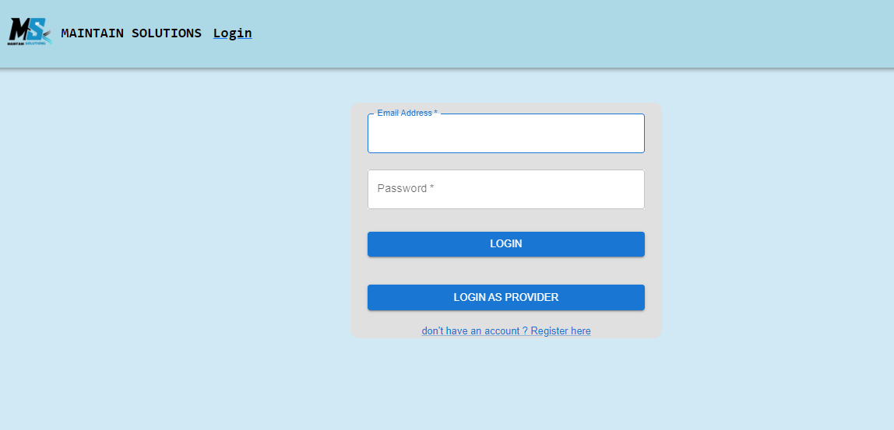
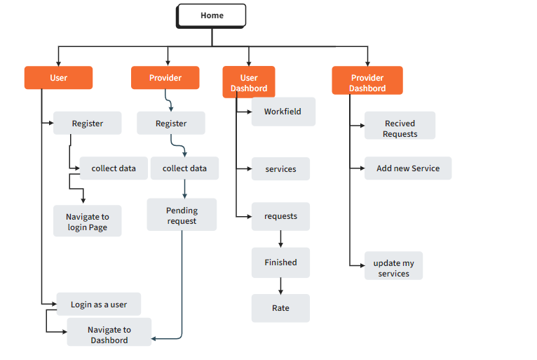

<p align="center">
<a href="https://www.meraki-academy.org" target="_blank" rel="noopener noreferrer">
 
 </a>
</p>

<h3 align="center">MAINTAIN SOLUTIONS
</h3>

---

<p align="center"> A Maintain solution website makes to connect individuals who need services with providers,making it easier for service providers to find work 
    <br> 
<a href=''>Demo</a>
    <br> 
</p>

## 📝 Table of Contents

- [About](#about)
- [Getting Started](#getting_started)
- [Usage](#usage)
- [Built Using](#built_using)
- [User Story](#user_story)
- [Data Flow](#data_flow)
- [Guided By](#guided_by)

## 🧐 About <a name = "about"></a>

Write about 1-2 paragraphs describing the purpose of your project.

Ex. Are you looking for a quick and easy way to find any service you need at the best price and fully trusted ? The MAINTAIN SOLUTIONS is the greatest and most accurate application to help you. It helps you to find multi providers of services with different experince.
 The MAINTAIN SOLUTIONS provides a simple design to ensure having the best user experience.
What if you are working frequently and there is no solutions to increase your workload ,MAINTAIN SOLUTIONS make to solution for you by registering your work on the site and publishing it to everyone

## 🏁 Getting Started <a name = "getting_started"></a>

These instructions will get you a copy of the project up and running on your local machine for development and testing purposes.

### Prerequisites

- Visual Studio Code follow this <a href='https://code.visualstudio.com/download'>link</a> to install.
- Git Bash follow this <a href='https://git-scm.com/downloads'>link</a> to install.
- MongoDB follow this <a href='https://www.mongodb.com/try/download/community'>link</a> to install.
- Node.js follow this <a href='https://nodejs.org/en/download/package-manager'>link</a> to install.

### Installing:

1. Clone the repo to your local machine using git bash.

```
git clone https://github.com/your_username_/Project-Name.git
```

2. Install packeges repeat this step in backend and frontend folder

```
npm i
```

3. Run server using git bash inside backend folder

```
npm run dev
```

4. Run application using git bash inside frontend folder

```
npm run start
```

Now app ready to use
s
## 🎈 Usage <a name="usage"></a>

Use this space to show useful examples of how a project can be used. Additional screenshots, code examples and demos work well in this space. You may also link to more resources.

Ex.

- You must to register to navigate our web app ,there is two mains register ,first one for user who need to service ,and the provider of the service

- first if you have an account or registered to the website you can logged in 


- After that you have a dashbord as a user for you requests of the services 

- You can find your service from fields then select your category after the page will show all services of the field (selected category )
- you can press to send request to send a request for the provider and wait until take the approve from the provider 


- if you are logged in as a provider there is the dashbord for your requests of own services 
- From myService you will find your service and update or delete it.

- you can make a new service by Create New Service then add your title and descritpion of your service


## ⛏️ Built Using <a name = "built_using"></a>

- [MongoDB](https://www.mongodb.com/) - Database
- [Express JS](https://expressjs.com/) - Server Framework
- [React JS](https://https://reactjs.org/) - Web Framework
- [Node JS](https://nodejs.org/en/) - Server Environment
- [MUI](https://mui.com/) -Design  
## User Story <a name = "#user_story"></a>

Your trello board link
<a href='https://trello.com/b/HjcEVLy4/project4'>Trello</a>

## Data Flow <a name = "#data_flow"></a>

</a>

## ⚠️ Guided By <a name = "guided_by"></a>

This project is guided by ©️ **[MERAKI Academy](https://www.meraki-academy.org)**